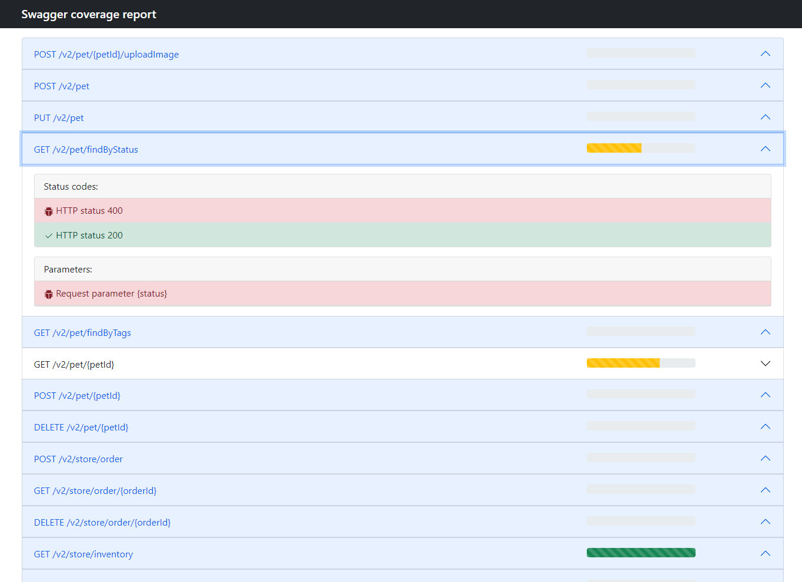

## Swagger coverage server

Swagger coverage server is language agnostic tool that gives a picture about coverage of APIs based on Open API (Swagger).

### Usage example:

```
docker run -p 3000:3000  reqover/reqover:latest
```

```
curl --location --request GET 'http://localhost:3000/v2/pet/9222968140497128105'
```

Open your browser:

```
http://localhost:3000/report
```


